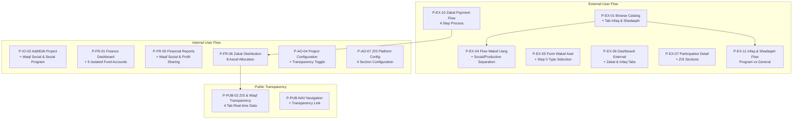

# ZIS IMPLEMENTATION BREAKDOWN - ACO PLATFORM

Berdasarkan analisis dokumentasi ZIS di `story/` directory dan struktur FE yang sudah ada.

## 📊 STATUS IMPLEMENTASI SAAT INI

### ✅ Komponen ZIS yang Sudah Ada:
1. **Zakat Basic Components**
   - [`ZakatPage.tsx`](aco-frontend/src/components/pages/ZakatPage.tsx:1) - Main zakat landing page
   - [`ZakatDetailPage.tsx`](aco-frontend/src/components/pages/ZakatDetailPage.tsx:1) - Zakat program detail
   - [`ZakatCalculator.tsx`](aco-frontend/src/components/organisms/ZakatCalculator.tsx:1) - Comprehensive zakat calculator
   - [`ZakatCard.tsx`](aco-frontend/src/components/molecules/ZakatCard.tsx:1) - Zakat program cards
   - Mock data in [`zakatMockData.ts`](aco-frontend/src/data/zakatMockData.ts:1)

2. **Basic Infrastructure**
   - Navigation supports zakat routes
   - Dashboard placeholders for ZIS
   - Routing infrastructure in place

### ❌ Yang Perlu Dibuat/Ditingkatkan:
Comprehensive ZIS implementation sesuai spesifikasi dokumentasi

## 🗺️ ZIS ARCHITECTURE FLOW



## 🎯 IMPLEMENTATION BREAKDOWN BY MODULE

### 📱 MODULE 6 - EXTERNAL USER (Revisions & Additions)

#### P-EX-01 Browse Catalog (Revision)
- [ ] Add "Infaq & Shadaqah" tab
- [ ] Waqf type filter (Social/Productive)
- [ ] Waqf type badges on cards
- [ ] Infaq program cards with progress bars
- [ ] "Target Met" badges for completed programs

#### P-EX-04 Waqf Money Flow (Revision)  
- [ ] Waqf type badges in all steps
- [ ] Destination account info per type
- [ ] Explicit ikrar text mentioning management type
- [ ] Conditional profit sharing section
- [ ] Toggle and bank account fields for profit sharing

#### P-EX-05 Waqf Asset Form (Revision)
- [ ] New Step 0: Choose Management Type
- [ ] Radio cards for Social vs Productive Waqf
- [ ] Explanation link for differences
- [ ] Profit sharing section for Productive Waqf

#### P-EX-06 External Dashboard (Revision)
- [ ] Add 2 new summary cards:
  - Total Zakat Paid
  - Total Infaq & Shadaqah
- [ ] New "Zakat" tab in participation
- [ ] New "Infaq & Shadaqah" tab in participation

#### P-EX-07 Participation Detail (Revision)
- [ ] Zakat-specific section with receipt download
- [ ] Infaq & Shadaqah section with report timeline

#### P-EX-10 (New) - Zakat Payment Flow
- [ ] Step 1: Choose Zakat Type (radio cards)
- [ ] Step 2: Calculator & Amount (collapsible accordion)
- [ ] Step 3: Payment Confirmation with intention checkbox
- [ ] Step 4: Payment Receipt with PDF download

#### P-EX-11 (New) - Infaq & Shadaqah Flow
- [ ] Step 1: Choose Program or General Fund
- [ ] Step 2: Enter Amount
- [ ] Step 3: Confirmation with sincerity checkbox
- [ ] Step 4: Donation Receipt with PDF download

### 💼 MODULE 2 - INVESTMENT OFFICER (Revisions)

#### P-IO-02 Add/Edit Project (Revision)
- [ ] New category: Waqf Social with specific fields
- [ ] New category: Social Program (Infaq & Shadaqah)
- [ ] Profit sharing field for Productive Waqf category
- [ ] Real-time validation: "Fee Nazir: X% · Profit Share: Y% · Mustahiq: Z%"

### 💰 MODULE 4 - FINANCE OFFICER (Revisions & Additions)

#### P-FR-01 Finance Dashboard (Revision)
- [ ] 5 fund cards (previously 4)
- [ ] Different colors for Waqf Social vs Productive funds
- [ ] Infaq fund breakdown per program + general fund

#### P-FR-05 Financial Reports (Revision)
- [ ] New report types: "Waqf Social" and "Profit Sharing"
- [ ] Waqf Social reports with income/expenditure
- [ ] Profit Sharing reports (conditional if feature active)

#### P-FR-06 (New) - Zakat Distribution to Asnaf
- [ ] Header with real-time balances and post-amil balance
- [ ] Distribution form per asnaf (8-row table)
- [ ] Confirmation modal with distribution summary
- [ ] Distribution history tab with period filters

### ⚙️ MODULE 5 - ADMIN (Revisions & Additions)

#### P-AO-04 Project Configuration (Revision)
- [ ] "Show in Transparency Page" toggle for ZIS & Waqf Social projects

#### P-AO-07 (New) - Platform Configuration: ZIS & Waqf
- [ ] Section 1: Zakat Configuration (type toggles, nisab, amil portion)
- [ ] Section 2: Profit Sharing Configuration (toggle, max limits)
- [ ] Section 3: Infaq & Shadaqah Configuration (general fund toggle)
- [ ] Section 4: Waqf Social Report Configuration (frequency)

### 🌐 MODULE 5 - PUBLIC PAGES (Additions)

#### P-PUB-02 (New) - ZIS & Waqf Transparency
- [ ] Tab 1: Zakat (summary, charts, asnaf table, history)
- [ ] Tab 2: Infaq & Shadaqah (summary, program list, reports)
- [ ] Tab 3: Waqf Social (summary, asset list, condition reports)
- [ ] Tab 4: Waqf Productive (summary, project list, financial reports)

#### P-PUB-NAV (Revision) - Navigation & Footer
- [ ] "Transparency" link in navbar and footer
- [ ] "Pay Zakat" button in navbar (conditional for KYC verified users)

## 🏗️ DATA STRUCTURE & API REQUIREMENTS

### Required TypeScript Types:
```typescript
// Zakat Types
interface ZakatTransaction {
  id: string;
  type: 'maal' | 'profesi' | 'fitrah' | 'emas' | 'perdagangan' | 'lainnya';
  amount: number;
  muzakkiName: string;
  date: Date;
  status: 'pending' | 'confirmed' | 'distributed';
}

interface AsnafDistribution {
  asnaf: string; // 8 asnaf types
  amount: number;
  recipient: string;
  description: string;
}

// Infaq & Shadaqah Types
interface InfaqProgram {
  id: string;
  name: string;
  description: string;
  targetAmount?: number;
  currentAmount: number;
  status: 'active' | 'completed' | 'target_met';
  beneficiaryDescription: string;
  reports: ProgramReport[];
}

interface InfaqTransaction {
  id: string;
  programId?: string; // null for general fund
  amount: number;
  donorName: string;
  date: Date;
}

// Waqf Social Types
interface WaqfSocialAsset {
  id: string;
  type: 'immovable' | 'movable' | 'cash_based';
  name: string;
  location: string;
  purpose: string;
  estimatedValue: number;
  condition: 'good' | 'needs_attention' | 'under_maintenance';
  beneficiaryCount: number;
  lastReportDate: Date;
  reports: AssetReport[];
}
```

### Required API Endpoints:
```
# Zakat Endpoints
GET    /api/zakat/transactions
POST   /api/zakat/pay
GET    /api/zakat/distributions
POST   /api/zakat/distribute

# Infaq Endpoints
GET    /api/infaq/programs
POST   /api/infaq/donate  
GET    /api/infaq/reports

# Waqf Social Endpoints
GET    /api/waqf-social/assets
POST   /api/waqf-social/report

# Admin Configuration
GET    /api/admin/zis-config
POST   /api/admin/zis-config
```

## 🎯 IMPLEMENTATION PRIORITIES

### 🚀 HIGH PRIORITY (Core Functionality)
1. **P-EX-10 Zakat Payment Flow** - Core zakat functionality
2. **P-FR-06 Zakat Distribution** - Finance officer core
3. **P-AO-07 ZIS Platform Config** - Admin configuration
4. **P-PUB-02 ZIS Transparency** - Public transparency

### 📈 MEDIUM PRIORITY (User Experience)
5. **P-EX-11 Infaq & Shadaqah Flow** - Complete donation flow
6. **P-EX-01 Browse Catalog Revision** - Better discoverability
7. **P-EX-06 Dashboard External Revision** - User dashboard enhancement

### 💡 LOW PRIORITY (Enhancements)
8. **P-EX-04/05 Waqf Flow Revisions** - Existing flow improvements
9. **P-IO-02 Add Project Revision** - Investment officer enhancement
10. **P-FR-01/05 Report Revisions** - Finance reporting improvements

## 📋 TOTAL DEVELOPMENT TODO ITEMS

**🆕 New Pages to Create: 5**
- P-EX-10 Zakat Payment Flow
- P-EX-11 Infaq & Shadaqah Flow
- P-FR-06 Zakat Distribution to Asnaf
- P-AO-07 ZIS Platform Configuration
- P-PUB-02 ZIS & Waqf Transparency

**🔄 Pages to Revise: 8**
- P-EX-01 Browse Catalog
- P-EX-04 Waqf Money Flow
- P-EX-05 Waqf Asset Form
- P-EX-06 External Dashboard
- P-EX-07 Participation Detail
- P-IO-02 Add/Edit Project
- P-FR-01 Finance Dashboard
- P-FR-05 Financial Reports

**🎨 Components to Update: 12+**
- Navigation components
- Dashboard cards and summaries
- Form components with new validations
- Reporting components
- Transparency display components

## ⚠️ SHARIAH COMPLIANCE NOTES

Critical validations to implement:
- Fee nazir cannot exceed 10% (BL-4.3)
- Fee nazir + profit sharing cannot exceed 50% (BL-4.3)
- Mustahiq must receive minimum 50% (BL-4.3)
- Amil portion cannot exceed 12.5% (BL-9.3)
- 5 fund accounts must remain completely isolated (BL-7.1)
- Waqf Social funds cannot be used for productive activities (BL-11.2)

## 📊 ESTIMATED DEVELOPMENT COMPLEXITY

- **Frontend**: ~120-150 hours
- **Backend Integration**: ~80-100 hours
- **Testing & QA**: ~40-60 hours
- **Total**: ~240-310 hours

Dengan breakdown ini, tim development bisa mulai implementasi secara sistematis dengan pemahaman yang jelas tentang scope dan priorities.